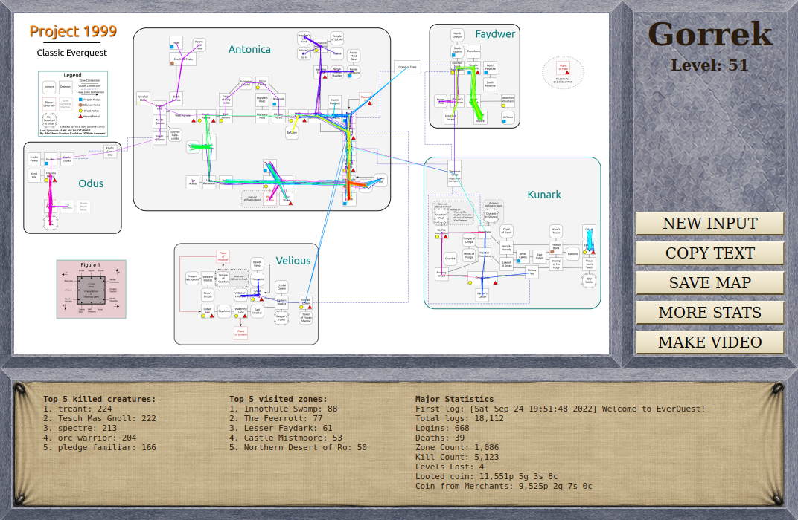

# THIS PROGRAM WORKS SOLELY BY READING YOUR LOG FILE.

Instructions:

- Project 1999: Download the [latest release](https://github.com/ajbtech/EQ-Travel-Map/releases/latest), unzip it and run EQTravelMap.exe


# EverQuest Travel Map

Generate a visual travel map and play summary from your EverQuest character's
log files. Drop in your logs, pick your character, click Generate.



[](https://github.com/ajbtech/EQ-Travel-Map/actions/workflows/test.yml)
[](LICENSE)
[](pyproject.toml)

## What it does

Reads your EverQuest log files chronologically and draws every valid
zone-to-zone trip on a map of the world. The colour of each line shows when
in your character's history that trip happened (older trips are drawn on top
so early adventures stay visible). Alongside the map, you get a copyable text
summary of kills, deaths, level-ups, looted coin, and merchant earnings.

The map shown above was generated from the bundled sample log
(`samples/sample_eqlog_Gorrek_P1999Green.txt`), a real Project 1999 character
trimmed down to ~1.3 MB so the project ships with a working first-run example.

### What you see on the output page

The results window has three things side-by-side under the rendered map:

- **Top 5 killed creatures** and **Top 5 visited zones** — the headline
  highlights of where you spent your time and what you fought there.
- **Major Statistics** — first log timestamp, total log lines, logins,
  deaths, zones visited, kills, levels lost, current level, looted coin,
  and coin earned from merchants.

Four buttons sit to the right of the map: **NEW INPUT** to parse another
character, **COPY TEXT** to put the summary on your clipboard, **SAVE MAP**
to export the rendered PNG anywhere on disk, and **MORE STATS** to open the
extra-stats window described below.

### Extra stats (MORE STATS button)

Click **MORE STATS** on the results window for a deeper breakdown that
doesn't fit on the main summary:

- **Top 25 visited zones** — the long tail of where your character has been.
- **Top 25 killed creatures** — the long tail of what your character has killed.
- **Top 25 cast spells** — which spells you've leaned on the most.
- **Max hit by damage type** — your biggest single hit broken down by
  `slash`, `pierce`, `backstab`, `bash`, `spell`, `crit`, and any other
  damage types that turned up in the logs.

---

## For EverQuest players (no Python or terminal needed)

> **Note:** A pre-built `EQTravelMap.exe` is attached to each
> [GitHub release](https://github.com/ajbtech/EQ-Travel-Map/releases).
> Download it from there — there is nothing to install and no terminal
> commands to run.

### Use it with your own EverQuest logs

1. In-game, type **`/log on`** once. EverQuest will start writing per-character
   log files into its `Logs` folder.
2. In the app, click **Browse** next to *Log folder* and pick that `Logs`
   folder. Common locations on Windows:
   - `%USERPROFILE%\EverQuest\Logs`
   - `C:\EverQuest\Logs`
   - `C:\Program Files\Sony\EverQuest\Logs`
   - `C:\Program Files (x86)\Sony\EverQuest\Logs`
3. Type your character's name exactly as it appears in the filename
   (`eqlog_<Character>_P1999Green.txt` → enter `<Character>`).
4. Click **Generate**. The longer your log history, the longer the parse
   takes — a multi-year archive can take a couple of minutes.
5. Use **Save Map As…** to keep the rendered PNG anywhere you like, or
   **Open Output Folder** to find the default copy in Explorer.

If anything goes wrong, the app shows a friendly explanation with a
"Show Details" button for the technical message — paste that into a
[bug report](https://github.com/ajbtech/EQ-Travel-Map/issues/new?template=bug_report.md)
and we'll take a look.

### Try it on the bundled sample (no logs of your own required)

1. Download both files from the
   [latest release](https://github.com/ajbtech/EQ-Travel-Map/releases/latest):
   `EQTravelMap-vX.Y.Z-windows.zip` and `EQTravelMap-samples.zip`.
2. Right-click → **Extract All…** on the windows zip anywhere on your computer.
3. Extract `EQTravelMap-samples.zip` *into the same extracted folder* so that
   `samples/` ends up next to `EQTravelMap.exe`.
4. Double-click **`EQTravelMap.exe`**. The form will be pre-filled with the
   bundled `samples/` folder and character name `Gorrek`. Click **Generate**.
5. After a few seconds you'll see the map and a summary with the option to
   copy them, save the map elsewhere, or open the output folder in Explorer.

> The sample logs ship as a separate, optional download so the main `.exe`
> bundle stays small for users who already have their own EverQuest logs.


---

## For command-line users

If you have Python 3.10+ and prefer running from source:

```powershell
git clone https://github.com/ajbtech/EQ-Travel-Map.git
cd EQ-Travel-Map
python -m venv .venv
.\.venv\Scripts\activate
pip install -r requirements.txt
```

Launch the desktop GUI:

```powershell
python src\desktop_app.py            # GUI, defaults pre-filled
python src\desktop_app.py Gorrek     # GUI, character name pre-filled
```

Or run the parser directly without the GUI:

```powershell
python src\eq_parser.py Gorrek                          # uses default paths
python src\eq_parser.py Gorrek --log-folder samples     # use bundled sample
python src\eq_parser.py Gorrek --log-folder C:\path\to\logs --output map.png
```

`eq_parser.py` prints the summary to stdout and writes the map PNG to
`--output` (default: `~/everquest_travel_map.png`).

---

## For developers

Full setup, testing, and packaging instructions live in
[CONTRIBUTING.md](CONTRIBUTING.md). The short version:

```powershell
pip install -e ".[dev]"
python -m pytest -q src
ruff check src && black --check src
pyinstaller --noconfirm --clean EQTravelMap.spec   # build the redistributable
```

Architecture and module conventions are documented in [CLAUDE.md](CLAUDE.md).
Open work and good-first-issue ideas live in [TODO.md](TODO.md).

The codebase splits into a streaming parse layer
(`src/log_parser.py`, `src/line_reader.py`), a rendering layer
(`src/eq_display.py`, `src/map_path.py`, `src/zone_graph.py`), a shared
text-summary layer (`src/summary_formatter.py`), and a PySide6 GUI
(`src/desktop_app.py`, `src/ui/`). Tests are colocated as `src/test_*.py`.

---

## License & acknowledgments

This project is released under the [MIT License](LICENSE).

It links against several third-party libraries that retain their own licenses,
notably **Qt 6** and **PySide6** under LGPL-3.0. Distribution is LGPL-compliant
because the bundle uses PyInstaller's `--onedir` mode (Qt DLLs remain
replaceable). See [LICENSES/README.md](LICENSES/README.md) for the full
attribution list and notes.

EverQuest and the world map artwork are property of Daybreak Game Company.
This is an unofficial fan project with no affiliation to Daybreak or the
Project 1999 team. The bundled `zone_map.png` is the
[Project 1999 Unofficial Zone Connection Map](https://wiki.project1999.com/Zone_Connection_World),
originally created by Yurz Truly of the Project 1999 server and later
expanded by Matthew Gordon Roulston (a.k.a Within Amnesia). Full per-file
credits live in [assets/ATTRIBUTION.md](assets/ATTRIBUTION.md).

Special thanks to the **Project 1999** community for keeping classic
EverQuest alive and to everyone who has reported issues against this tool.

> Made by **Gorrek** on the **Green** server.

---

## Roadmap

See [TODO.md](TODO.md) for the maintainer's working notes and
[GitHub Issues](https://github.com/ajbtech/EQ-Travel-Map/issues) for
discussion. Post-1.0 ideas under consideration:

- Better Kunark zone center positions
- Live "follow me" view that updates the map as you play
- Zoom and pan in the desktop view
- Dynamic results-window resizing
